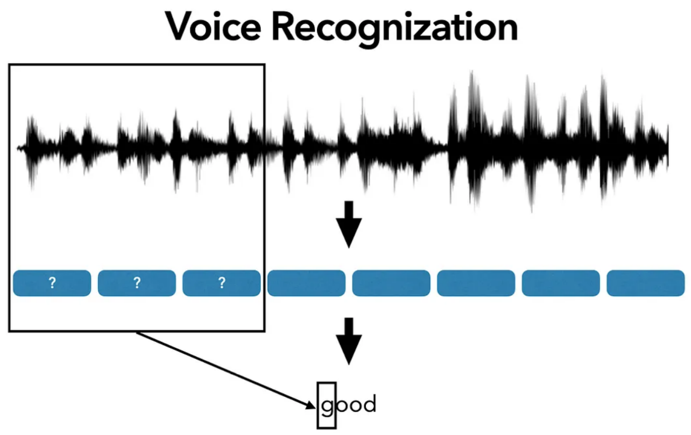

# Connectionist Temporal Classification (CTC) Loss

#### Credit:
Full credit for this CTC Implementation goes to [vadimkantorov](https://github.com/vadimkantorov) at the repo [ctc](https://github.com/vadimkantorov/ctc/tree/master)! I just simplified it a little and added comments about what is going on!

### The Alignment Problem
Most tasks in natural language processing (NLP) are straightforward because our input and output tokens are aligned—there’s a one-to-one correspondence. For example, in machine translation, each word in the source sentence maps to a word (or phrase) in the target sentence, and we can train a model to predict these mappings directly. But in problems like speech processing, this isn’t so simple. The key issue is that audio and its corresponding transcript are of different lengths! Audio is a continuous signal, often represented as a sequence of frames (e.g., 100 frames of 10ms each for a 1-second clip), while the transcript is a discrete sequence of characters or words (e.g., "good" has 4 letters). So, how do we learn the mapping between the two when the lengths don’t match and we don’t know which audio frames correspond to which letters?
Here’s a great figure from an article by Eric Lam that illustrates this:



Imagine some audio of someone saying the word "good." The audio might be split into T=20 frames (time steps), while the text "good" has S=4 characters. Which of those 20 frames correspond to the letter g? Which ones are o? Are both o’s in the same frames, or spread out? This is the alignment problem in tasks like Automatic Speech Recognition (ASR). Without knowing the alignment beforehand, training a model becomes tricky because traditional loss functions (like cross-entropy) expect a clear target for each input step.

### CTC Is Alignment Free
The CTC loss was designed to solve this problem by being alignment-free. You don’t need to explicitly provide the alignment between the audio (input) and the transcript (output)—CTC figures it out by summing the probabilities of all possible alignments that could produce the target sequence. This makes it incredibly powerful for tasks where alignment isn’t given, like speech recognition or handwriting recognition.
CTC achieves this with two key ideas:

1) Repetition of Labels: The model can repeat a letter as many times as needed across time steps to match the duration it’s spoken in the audio. For example, "good" might have several frames outputting o for the prolonged "oo" sound.

2) Blank Token (-): CTC introduces a special "blank" token (often denoted - or index 0) that acts as a separator or filler. It helps distinguish between:
Repeated letters in the audio (e.g., O O collapsing to one O because it’s the same sound stretched out).

These rules allow CTC to generate many valid ways to "write" a word like "cat" depending on the number of time steps (T) in the input audio. Let’s look at some examples:

#### Audio T = 3 (minimum length needed)

1) [C, A, T]

#### Audio T = 4

1) [-, C, A, T]
2) [C, C, A, T]
3) [C, A, A, T]
4) [C, A, T, -]
5) ...
   
#### Audio T = 5

1) [-, C, A, T, -]
2) [-, C, C, A, T]
3) [-, C, A, A, T]
4) [C, -, A, -, T]
5) [C, C, A, T, -]
6) [C, A, -, T, T]
7) ...

The blank tokens basically act as filers and repeated tokens (not separated by blank) are collapsed to the same word CAT

### Model Outputs

A neural network (e.g., an RNN or Transformer) processes the audio and outputs a tensor of shape [T, B, C]:

    T: Number of time steps (e.g., audio frames).
    B: Batch size (number of samples).
    C: Number of classes (e.g., vocabulary size, including the blank token).

This tensor contains logits—raw, unnormalized scores for each character (including the blank) at each time step for each sample. We pass these logits through a softmax function along the class dimension (C) to get probabilities:
$P(class | t, b)$

### Dynamic Programming

You might wonder: if CTC needs to sum the probabilities of all possible alignments (like [-, C, A, T], [C, -, A, T], etc.), why not just list them all out and add them up? The problem is that the number of possible alignments grows exponentially with the input length T. For "CAT" with T=5, we found 11 alignments, but for T=10, there could be hundreds or thousands! Computing each one individually would be impossibly slow, especially for real-world audio with T in the hundreds or thousands.

Instead we can use a Dynamic Programming technique (forward algorithm) to iteratively computing all possible paths upto a specific position before going onto the next one. These are known as $\alpha$ terms, that is a matrix we will build, containing the log probability of being at position ```s``` in the sequence at time ```t``` in the model output, and summing upto all possible paths to that point. 

The reason this is faster is because, we will reuse all the computations already done upto position ```s``` to move onto the next one. In the naive approach, we would literally try every combination. We get the same result, just in a smarter way!
