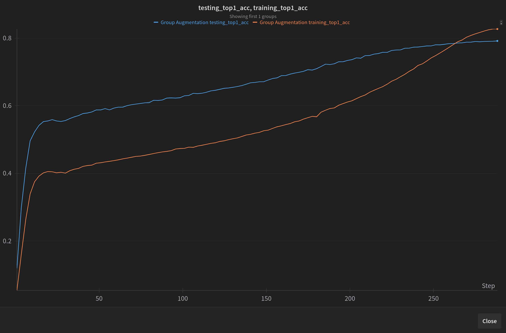
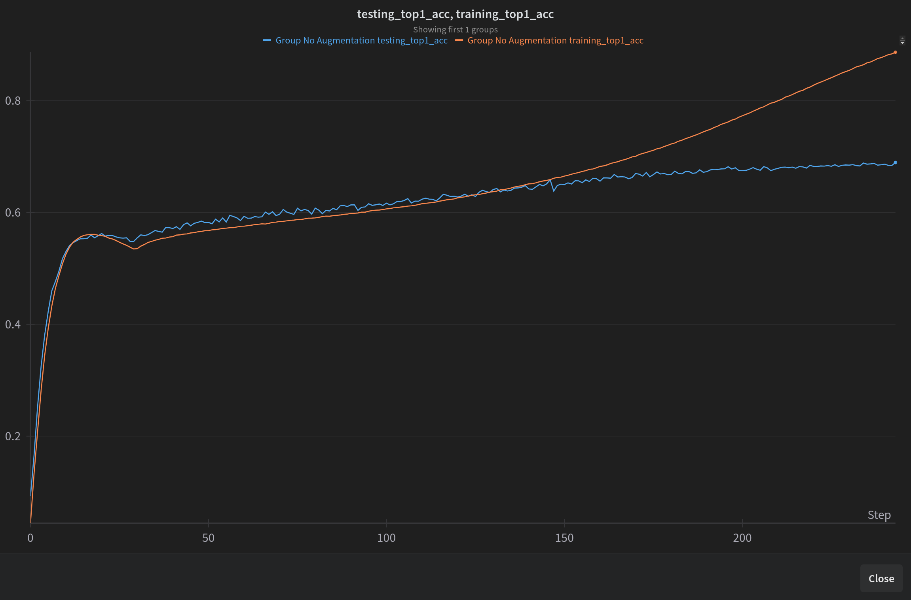

## Dive into Attention with the Vision Transformer &nbsp; [](https://colab.research.google.com/drive/1Mh-yaSWwfTs1UcOdRQjRIvLuj6PU6liZ?usp=sharing)


Until a few years ago, Convolutions have been the default method of all Deep Learning for Vision tasks. But there was a limitation
of the Convolution mechanic that prompted the creation of the Vision Transformer: Lack of Spatial Attention. More specifically, 
this means that Convolutions are able to model local features within the kernel size very well, but there was no way to explain
how the top left part of an image is related to the bottom right. 

The Transformer architecture was able to solve this for Sequence data, as the main goal is to learn the relationships between
different pairs of words. In the same way, the goal of the Vision Transformer will be to learn how different parts of an image
are related to one another. 

This will be our first exploration of the Transformer architecture and we will be implementing everything from scratch!
This means we want to learn the properties of the Attention mechanism and how to actually implement them using only PyTorch!
The main ideas we will cover are:

- Why Attention and not Convolutions?
- Patch Embeddings (Conversion of Images to "sequences")
- Understanding CLS tokens and Positional Embeddings
- How to build a single Attention Head (Q, K, V)
- Expanding Single Headed Attention to MultiHeaded Attention
- The purpose of LayerNormalization

## Reproducing ViT-Base on ImageNet

Although most people are interesting in fine-tuning a model, doing large scale training on a dataset like ImageNet is much tougher and there are a lot more considerations. If you don't have the resources for this, thats ok, you can follow along with the [jupyter notebook](VisionTransformer.ipynb) which will show the structure of the model and training on a small dogs vs cats example!

### Downloading ImageNet

[Here](https://gist.githubusercontent.com/antoinebrl/7d00d5cb6c95ef194c737392ef7e476a/raw/74a1246c9254676e19c106ae67e57c9a174ff5de/prepare.sh) is a really convenient script and instructions that can take the `ILSVRC2012_img_train.tar` and `ILSVRC2012_img_val.tar` files you download from the [official Imagenet website](https://image-net.org/download.php). Just follow the instructions and download the data, just keep track of the path to where you save the data as we will need that later!

### Setup Training Environment
 Next create a folder for where you want to store your checkpoints. Also verify that you have Accelerate installed and go through the prompts when you enter ```accelerate config``` to let it know information about the system and what resources you want to use. You can also run ``accelerate test`` to verify the installation and access to the identified resources Pass the path to your imagenet data and working directory to the command below and you are good to go!

### Resources Used 
All Training was done on a 4 x A100 GPU Node! 


### Train Vision Transformer on ImageNet-1K
```
accelerate launch train.py \
        --experiment_name "ViT_Imagenet_Training" \
        --wandb_run_name "vit_imagenet_training" \
        --path_to_data "<PATH_TO_IMAGENET_ROOT>" \
        --working_directory "<PATH_TO_WORK_DIR>" \
        --num_classes 1000 \
        --epochs 300 \
        --warmup_epochs 30 \
        --save_checkpoint_interval 10 \
        --per_gpu_batch_size 384 \
        --gradient_accumulation_steps 1 \
        --learning_rate 0.01 \
        --weight_decay 0.1 \
        --random_aug_magnitude 9 \
        --mixup_alpha 0.2 \
        --cutmix_alpha 1.0 \
        --label_smoothing 0.1 \
        --max_grad_norm 1.0 \
        --img_size 224 \
        --num_workers 32 \
        --custom_weight_init \
        --log_wandb
```

You can explore the results of this training [here](https://api.wandb.ai/links/exploratorydataadventure/ymofxjnk)!

## The Importance of Data Augmentation

The inclusion of heavy augmentation (Mixup/Cutmix/RandomAug) was crucial to reach a roughly 80% top-1 accuracy, just shy of the 81% [reported by PyTorch](https://pytorch.org/vision/main/models/generated/torchvision.models.vit_b_16.html#torchvision.models.vit_b_16). Without these augmentations, we see heavy overfitting and only a 68% top-1 accuracy!

### Training Curve With Augmentation


### Training Curve Without Augmentation



