# Latent Diffusion Models


We will be finally building what we have been working up to! Latent Diffusion Models! Now to fully understand this, there are a lot of pre-requisites:

- [Variational AutoEncoders](https://github.com/priyammaz/PyTorch-Adventures/blob/main/PyTorch%20for%20Generation/AutoEncoders/Intro%20to%20AutoEncoders/Variational_AutoEncoders.ipynb)
- [UNET](https://github.com/priyammaz/PyTorch-Adventures/tree/main/PyTorch%20for%20Computer%20Vision/UNET%20for%20Segmentation)
- [GAN](https://github.com/priyammaz/PyTorch-Adventures/tree/main/PyTorch%20for%20Generation/Generative%20Adversarial%20Network/Intro%20to%20GANs)
- [Diffusion](https://github.com/priyammaz/PyTorch-Adventures/tree/main/PyTorch%20for%20Generation/Diffusion/Intro%20to%20Diffusion)

What makes latent diffusion models so unique is, instead of training a the expensive diffusion model (with our UNet) on the high dimensional pixel space, we can instead do it on a compressed latent space! For example, instead of doing an expensive diffusion model at a ```3 x 224 x 224``` image, we can use an AutoEncoder to first compress the image down to ```4 x 32 x 32``` and then do diffusion at this must lower dimensional compressed image!

This means building stable diffusion has two stages:
- Train a Variational AutoEncoder for learning the latent space
- Train a Diffusion model on the compressed space

## Step 1: Prepare Dataset

We will be working on 2 different datasets here for our VAE pretraining. 

- **CelebAHQ** (Unconditional Generation)
- **Conceptual Caption** (Text Conditional)

### CelebAHQ
To download the CelebAHQ you can just get it from the original link [here](https://celebv-hq.github.io/)

### Conceptual Captions (3M)
To get [**Conceptual Captions**](https://ai.google.com/research/ConceptualCaptions/download) is a bit of a challenge. This is a dataset by google of 3 Million image/text pairs. The dataset that most of these Diffusion models are trained on is [**LAION-5B**](https://laion.ai/blog/laion-5b/) which is a collection of 5 Billion image/text pairs. This is way beyond the scope of my computational limits, so Conceptual Captions seemed like a good compromise of a relatively large number of images but nothing to crazy!

First step is to go to the [**Conceptual Captions**](https://ai.google.com/research/ConceptualCaptions/download) download page and download the [training-split](https://storage.cloud.google.com/gcc-data/Train/GCC-training.tsv?_ga=2.191230122.-1896153081.1529438250). Now the thing is that, for these types of datasets, you can't just download all the images and text. Instead this file we download provides a link to every image and their cooresponding caption. 

We can now use this super helpful package [img2dataset](https://github.com/rom1504/img2dataset) by [rom1504](https://github.com/rom1504) that will *Easily turn large sets of image urls to an image dataset.*

All we need to do is pass in the path to our TSV files and the path to the output folder where we want to save our data. I also choose to save the dataset as a **parquet** format, so I can then use Huggingface datasets to prep it!

```bash
img2dataset --url_list <PATH_TO_TSV> \
            --input_format "tsv"\
            --url_col "url" \
            --caption_col "caption" \
            --output_format parquet \
            --output_folder <PATH_TO_RAW_SAVE> \
            --processes_count 32 \
            --thread_count 128 \
            --image_size 256 \
            --resize_mode keep_ratio
```

Now that we have the data downloaded (this takes some time) we need to prepare it. To prepare our dataset, all we need to do is convert the binary data that was downloaded to PIL Images, and we also need to tokenize all the text! We can then take all the processed data and save our final copy of it!

```bash
python prep_cc.py --path_to_data_root <PATH_TO_RAW_SAVE> \
                  --path_to_save <PATH_TO_PROCESSED_SAVE> \
                  --hf_clip_model_name openai/clip-vit-large-patch14 \
                  --hf_cache_dir <HF_CACHE_DIR> \
                  --cpu_batch_size 512 \
                  --gpu_batch_size 256 \
                  --num_cpu_workers 32 \
                  --dtype bfloat16
```
Now even though this dataset had 3 Million or so images, not all the links are valid (websites can change or break over time), so I had a final dataset of about 2.3 Million images at the end!

## Stage 1: VAE Pretraining

First step is our VAE Pretraining! Now technically we can pick either the ```Variational AutoEncoder``` or the ```Vector-Quantized Variational Autoencoder```. We will train both just to see, but we will move forward with the Variational AutoEncoder as that was the default model used in Latent Diffusion. 

### Perceptual Loss (LPIPS + PatchGAN)

As you can imagine, the VAE is actually the star of this model. The quality of our generations depend completely on the VAE Decoder. The problem is, we know that VAE models typically lead to smoothed out images that lack sharpness. This is due to two main reasons: (1) The VAE interpolates between image types in the latent space and (2) Reconstruction loss is not a perceptual loss. 

Now the main reason for using a VAE is that if we have some known structure in the latent space (being close to gaussian normal) then the diffusion model will have an easier time learning the latent space itself! The VQVAE model does improve on this, but what can we do instead? Introduce a perceptual loss function!

#### LPIPS (Learned Perceptual Image Patch Similarity)

LPIPS is a neural network (VGG) that has been trained on patch similarity. It estimates the "quality" of an image. There were other methods for this before, such as PSNR/SSIM/FSIM that estimate image quality, but LPIPS show that that features extracted from a Deep Neural Network are much more effective as a perceptual metric. You can see all the details about this at the original repository [PerceptualSimilarity](https://github.com/richzhang/PerceptualSimilarity) by [RichZhang](https://github.com/richzhang)!

##### Use the LPIPS Package 
Use of LPIPS is very easy, here is the example from the repository:

```python
import lpips
loss_fn = lpips.LPIPS(net='vgg')
d = loss_fn.forward(im0,im1)
```

##### Lets Build/Train LPIPS
It would be more interesting to actually build and train our own LPIPS, so lets do that! To do this, we will be using a dataset called [Berkeley Adobe Perceptual Patch Similarity Dataset (BAPPS)](https://www.kaggle.com/datasets/chaitanyakohli678/berkeley-adobe-perceptual-patch-similarity-bapps) that you can go ahead and download from Kaggle!

This dataset has triplets of images, the original image and two different perturbations done to it. A human evaluator then picks which image is closer to the
original. Here is an example!

| Reference | Option 1 | Option 2 |
|:----------------------------:|:----------------------------:|:----------------------------:|
| 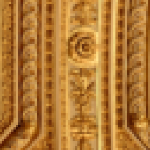 | 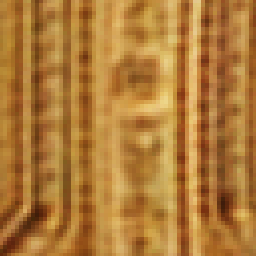 | 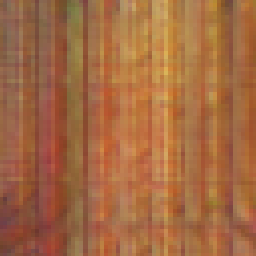 |

A human will then label a dataset like this identifying things like, option 1 is closer to the reference than option 2.

The reason this works is, the neural network will learn which images are perceptually higher quality, and then we can use this neural network to create a new loss function that will evaluate the quality of the images generated by our VAE.

To train our LPIPS you can use the following script!

```bash
accelerate launch lpips_trainer.py \
  --path_to_root <PATH_TO_DATA_ROOT> \
  --work_dir <PATH_TO_WORK_DIR> \
  --checkpoint_name "lpips_64x64_vgg.pt" \
  --img_size 64 \
  --batch_size 25 \
  --num_workers 32 \
  --num_epochs 10 \
  --decay_epochs 5 \
  --logging_steps 250 \
  --pretrained_backbone \
  --use_dropout \
  --img_range minus_one_to_one \
  --middle_channels 32 \
  --eval_lpips_pkg \
  --mixed_precision 
```

##### Evaluate Model

Out of curiosity, I wanted to make sure that my results are close the the original LPIPS results on the evaluation set, so here were those results on the different types of image artifacting!

```
-----------
Evaluating: LPIPS Reproduction
-----------
Dataset: CNN -> Accuracy: 0.826
Dataset: TRADITIONAL -> Accuracy: 0.772
Dataset: COLOR -> Accuracy: 0.624
Dataset: DEBLUR -> Accuracy: 0.595
Dataset: FRAMEINTERP -> Accuracy: 0.627
Dataset: SUPERRES -> Accuracy: 0.694
-----------
Evaluating: Original LPIPS
-----------
Dataset: CNN -> Accuracy: 0.822
Dataset: TRADITIONAL -> Accuracy: 0.735
Dataset: COLOR -> Accuracy: 0.617
Dataset: DEBLUR -> Accuracy: 0.594
Dataset: FRAMEINTERP -> Accuracy: 0.624
Dataset: SUPERRES -> Accuracy: 0.696

```
#### PatchGAN

The second part of our perceptual loss is the inclusion of a GAN mechanism. In this case, the generator is the VAE, and so we can use a PatchGAN discriminator introduced in [Image-to-Image Translation with Conditional Adversarial Networks](https://arxiv.org/pdf/1611.07004v3)! 

There are two key ideas to take away about this GAN:

1) This is a PatchGAN discriminator, so it will tell us whether or not individual pieces of an image area real vs fake, rather than the entire image like we typically do for GANs. 
2) Training of the GAN is delayed. We first train the VAE only to get it able to generate well, and then we add in the discriminator later in training to continue improving the perceptual quality of the results.

### Train the VAE

It is time to start training the VAE model! Now I hate config files as much as the next person, but to organize all this, I created a few ```.yaml``` files to control the model structure and the training scripts. 

#### Define the VAE Structure

In the [```ldm.yaml```](configs/ldm.yaml) you will find the VAE structure as the following:

```
img_size: 256
in_channels: 3
out_channels: 3
latent_channels: 4
residual_layers_per_block: 2
attention_layers: 1
attention_residual_connections: True
post_encoder_latent_proj: True
pre_decoder_latent_proj: True
vae_channels_per_block:
- 128
- 256
- 512
- 512
vae_up_down_factor: 2
vae_up_down_kernel_size: 3

### Additional VQ Configs ###
quantize: False
codebook_size: 16384
vq_embed_dim: 4
commitment_beta: 0.25
```

This will define the everything about the VAE such as:

**vae_channels_per_block** which will control both the number of channels at each residual block, but also how many residual blocks we want. In this case, we are starting with an image resolution of 256x256, and having 4 blocks. This will do 3 downsamples (between each set of blocks) of a factor of 2, so we will downsample images of size 256x256 by a factor of 8 to 32x32

**latent_channels** which controls how many channels we want in the latent dimension

**quantize** which is a boolean identifying if we want to do a VQ-VAE or just a regular VAE

#### Define the Training Setup

In the [```stageq_vae_train.yaml```](configs/stage1_vae_train.yaml) we define everything we need to train our model (there is a separate config for [VQVAE training](configs/stage1_vqvae_train.yaml))

### Train VAE!

Its time to train our VAE. You can do that simply with the following command:

```bash
accelerate launch stage1_vae_trainer.py \
  --experiment_name "VAETrainer" \
  --wandb_run_name "vae_celeba" \
  --working_directory "work_dir/vae_celeba" \
  --training_config "configs/stage1_vae_train.yaml" \
  --model_config "configs/ldm.yaml" \
  --dataset celebahq \
  --path_to_dataset "<PATH_TO_CELEBAHQ>" \
  --path_to_save_gens "src/celebahq_vae_gen"
```
If you want to train the model on Conceptual Captions then similarly you can do:

```bash
accelerate launch stage1_vae_trainer.py \
  --experiment_name "VAETrainer" \
  --wandb_run_name "vae_cc" \
  --working_directory "work_dir/vae_cc" \
  --training_config "configs/stage1_vae_train_cc.yaml" \
  --dataset conceptual_captions \
  --path_to_dataset "<PATH_TO_CONCEPTUAL_CAPTIONS>" \
  --path_to_save_gens "src/cc_gen"
```

### Results

The proof is in the pudding! What do reconstructions from our VAE look like? Lets first look at our CelebAHQ

#### CelebAHQ VAE (No LPIPS/No PatchGAN)

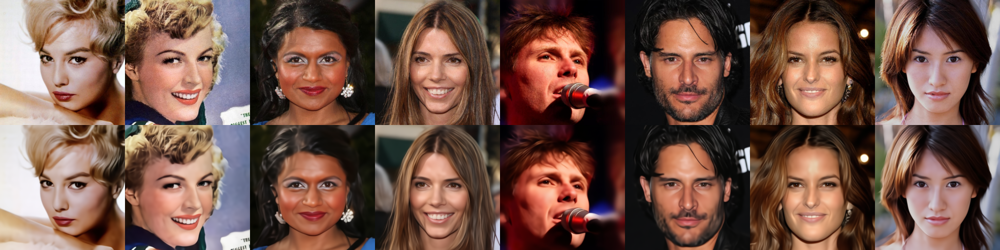

#### CelebAHQ VAE (w/ LPIPS + PatchGAN)

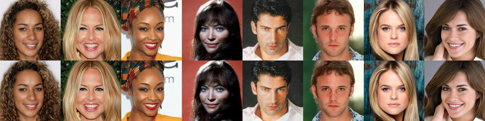

#### CelebAHQ VQ-VAE (w/ LPIPS + PatchGAN)

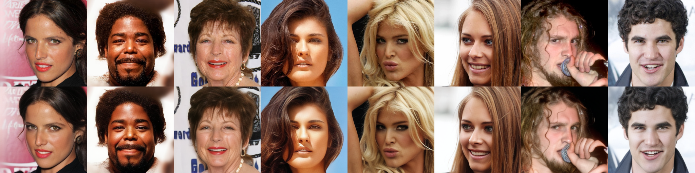

The results on CelebAHQ using LPIPS and the perceptual Loss is significantly better, as we dont have any significant amounts of smoothing. Look like perceptual losses do something helpful for our final image quality! The VQ-VAE images also look very good, maybe slightly sharper on the skin texture, but its hard to tell. 

Lets look at the other datasets now!

#### Conceptual Captions

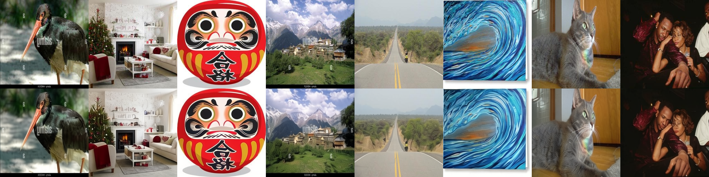

#### ImageNet

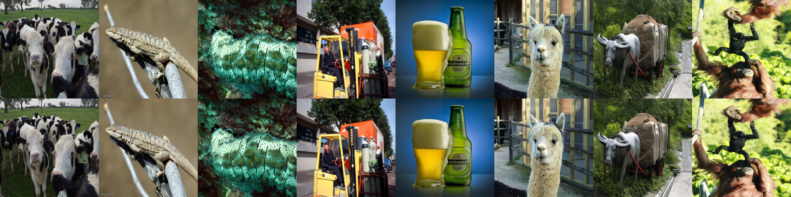

### Compute Latent Scaling Factor

One thing you will see in the Latent Diffusion model implementation is the constant 0.18215 used to scale the output of the VAE Encoder. If you search for this constant in the [Huggingface Diffusers](https://github.com/huggingface/diffusers) package, it will show up everywhere! For example here are some lines from one of their stable diffusion pipelines:

```python
image_latents = init_latent_image_dist.sample(generator=generator)
image_latents = 0.18215 * image_latents
...
latents = 1 / 0.18215 * latents
image = self.vae.decode(latents).sample
```

The main idea here is that, our VAE is trained to hopefully have a standard normal latent space, but in practice this isn't the case. The mean should be close to 0, but the variance may not be 1! Luckily for us, we can easily scale a gaussian distributions variance by multiplying by a constant, and thats exactly what you see here. 

0.18215 is a constant, that when you multiply the output of encoder by it, the variance of the latent space will be close to 1. This also means, when we decode our images with the decoder, we must divide by this constant, as this additional operation was not there during training time, only at inference!

The reason we are doing this is, now that we are training our diffusion model in the next stage, the latent space will be close to standard normal.

[Here](https://github.com/huggingface/diffusers/issues/437) is a great place to get more information on this if curious, as its a commonly asked question!

#### Calculate our own Latent Scaling 
Now 0.18215 was for the VAE that they trained on the LAION-5B dataset. We should calculate our own. Because we have a few different models, we have to calculate this for each model on each dataset, so we can do that as follows:

```bash
python compute_vae_scaling.py \
    --path_to_pretrained_weights <PATH_TO_VAE.safetensors> \
    --dataset "celebahq" \
    --path_to_dataset "<PATH_TO_DATA>"

```

By doing this, I got the following scaling factors (which I have stored in the LDM config):

```bash
  #### Precomputed Constants ###
  celebahq: 0.8924759
  imagenet: 0.9515730
  conceptual_captions: 0.9091397
```

Also notice that the constants I calculated are pretty close to 1. This means, my VAE was able to successfully get a latent space close to a variance of 1 which is cool. The most likely reason the original VAE from stable diffusion couldnt is because its trained on a much larger dataset, and the model was unable to compress the variance down. Either way, this is just a good next step!

## Stage 2: Latent Diffusion

Now that we have a model that can successfully compress and reconstruct, its time to do diffusion! This part is no different than any other diffusion model, we are just training on the latent space and using standard MSE loss (or L1/Huber if you want)

### Diffusion Scheduler

The original paper used a DDIM scheduler, but I just stuck to regular DDPM here to avoid making this mode complicated than it needs to be! I use the same DDPM scheduler that we wrote in the [Intro to Diffusion](https://github.com/priyammaz/PyTorch-Adventures/tree/main/PyTorch%20for%20Generation/Diffusion/Intro%20to%20Diffusion) with a linear variance schedule.

### Train Diffusion Model

All we have left to do is train Diffusion! The training config can be changed at [```stage2_diffusion_train.yaml```](configs/stage2_diffusion_train.yaml)

Here is an example lauch script to do this:

```bash
accelerate launch stage2_diffusion_trainer.py \
  --experiment_name "DiffusionTrainer" \
  --wandb_run_name "diffusion_celebahq" \
  --working_directory "work_dir/diffusion_celebahq" \
  --training_config "configs/stage2_diffusion_train.yaml" \
  --model_config "configs/ldm.yaml" \
  --path_to_vae_backbone "<PATH_TO_VAE.safetensors>" \
  --dataset celebahq \
  --path_to_dataset "<PATH_TO_DATA>" \
  --path_to_save_gens "src/diffusion_celebahq"
```

When training the Text Conditional Diffusion model on Conceptual Captions, the script looks like:

```bash
accelerate launch stage2_diffusion_trainer.py \
  --experiment_name "DiffusionTrainer" \
  --wandb_run_name "diffusion_cc" \
  --working_directory "work_dir/diffusion_cc" \
  --training_config "configs/stage2_diffusion_train.yaml" \
  --model_config "configs/ldm.yaml" \
  --path_to_vae_backbone "<PATH_TO_VAE.safetensors>" \
  --dataset conceptual_captions \
  --path_to_dataset "<PATH_TO_DATA>" \
  --path_to_save_gens "src/diffusion_cc"
```

Also, you can optionally edit the file [sample_text_cond_prompts.txt](inputs/sample_text_cond_prompts.txt). These are the prompts, that as the model is training, you can see what the results look like on these specific text inputs!

### Results

#### CelebAHQ

Lets first see what unconditional generation looks like! 

| Sample1 | Sample2 | Sample3 |
|:----------------------------:|:----------------------------:|:----------------------------:|
| 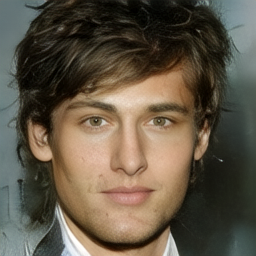 | 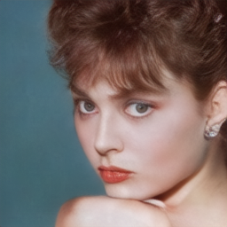 | 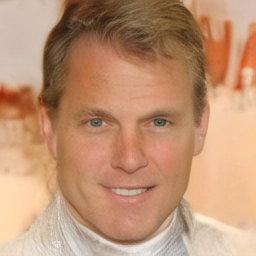 |

Im pretty happy with these!

#### Conceptual Captions

What about when we provide some prompts? Lets try the following text prompts:

- **Prompt 1**: A beautiful sunset at the beach
- **Prompt 2**: A foggy magical forest
- **Prompt 3**: A futuristic city skyline at night with neon lights
- **Prompt 4**: A cozy coffee shop with books

| Prompt 1 | Prompt 2 | Prompt 3 | Prompt 4 |
|:----------------------------:|:----------------------------:|:----------------------------:| :----------------------------:|
| 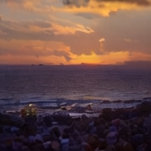 | 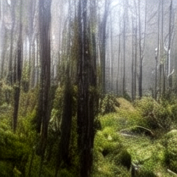 | 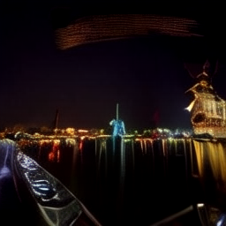 | 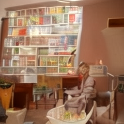 |
 

These also look pretty cool! I mean they arent Stable Diffusion level, but I dont have 256 GPUs just lying around, as a proof of concept though I am quite happy!

#### Why Clean Training Data Matters
 
An interesting attribute of my generations was that a watermark shows up in the generations! This means the Conceptual Captions dataset had a ton of watermarks on the pictures and the VAE ended up encoding this in the latent space. Here is an example of an image I generated with the prompt *A beautiful sunset at the beach* and the watermark and border shows up. This is why cool datasets like [LAION-AESTHETICS](https://laion.ai/blog/laion-aesthetics/) because images are prefiltered for quality. 

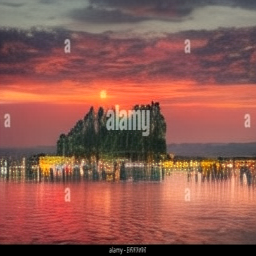

