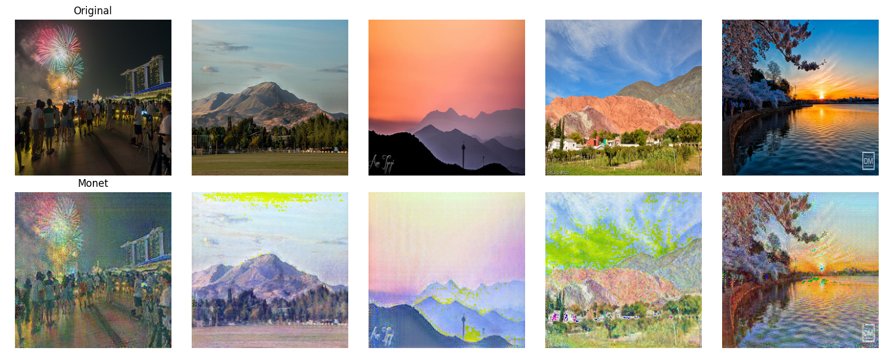

# CycleGAN


Image to Image translation is a super cool problem! What if I could convert photos to paintings? Or what if I could make sketches into images? Although this sounds great, creating a parallel dataset would be nearly impossible. 

Imagine you have a dataset of landscape images. If you wanted to train a model to convert them to paintings, you would first have to painstakingly create a painting for each image! Unless you are an artists, this is impossible!

CycleGAN enables us to do style transfers between images **WITHOUT PARALLEL DATA**. All we need is a bunch of source images that we want to convert, and target images in the style that we want! Today we will be working on a parallel dataset of landscape photos and Monet paintings. You can find this dataset [here at Kaggle!](https://www.kaggle.com/datasets/balraj98/monet2photo)

## CycleGAN Structure
In CycleGAN there are two Generators and two Discriminators:

- src2tgt_G: Takes source images (landscape) and maps to target (Monet)
- tgt2src_G: Takes target images (Monet) and maps to source (landscape)
- src_D: Identifies if an image is a source image (landscape) or isn't
- tgt_D: Identifies if an image is a target image (Monet) or isn't

### Step 1: Source to Target
- First pass real source images into ```src2tgt_G``` to produce fake target images
- Pass fake targets to ```tgt_D``` to identify are these real of fake (adversarial loss)
- Pass fake targets to ```tgt2src_D``` returning back to source images. 
- Compute a reconstruction L1 loss (cycle consistency loss) between our reconstructed source images and the real source images

### Step 2: Target to Source
- First pass real target images into ```tgt2src_G``` to produce fake source images
- Pass fake source to ```src_D``` to identify are these real of fake (adversarial loss)
- Pass fake source to ```src2tgt_D``` returning back to target images. 
- Compute a reconstruction L1 loss (cycle consistency loss) between our reconstructed target images and the real target images

As you can see, are doing the same thing twice, swapping between the two domains!

## Results


