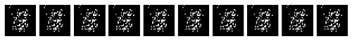

# Introduction to GANs 

Generative Adversarial Networks have for a long time been the state-of-the-art method of training generative models! Although Diffusion is more prevalent today, the GAN loss shows up quite a bit. For example, in the future when we train a Latent Diffusion model, one of the loss functions used to train the Variational AutoEncoder is the PatchGAN loss! 

Today we set the stage for GANs by training a few simple examples:
- Original GAN implementation on MNIST
- Conditional GAN to provide control over the generation
- Convolution-based generator to move away from linear layers

We will also derive at a high level the GAN Loss to understand the min/max adversarial game between the generator and discriminator. 

### Example Generation!

